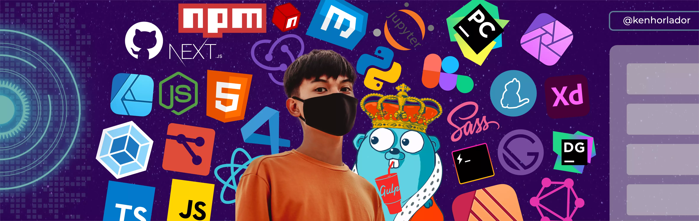

<!-- Header -->
<!-- ## "Hello World" 👋 -->

<!--  -->

<h1>Hello, I'm <strong>&lt;Ken Horlador /&gt; </strong> === 'a Tech Enthusiast'</h1>

<!-- ###  Also, a Layout Artist -->

<a href="https://github.com/kenhorlador"></a>

<a href="https://www.github.com/kenhorlador"></a>

<!-- Connect with Me -->
<p>
  <h2><strong>Connect with me:</strong></h2>
    <p>
        <!-- Facebook --><a href="https://web.facebook.com/kenhorlador/"></a>
        <!-- Instagram --><a href="https://www.instagram.com/kenhorlador"></a>
        <!-- Twitter --><a href="https://twitter.com/kenhorlador"></a>
        <!-- LinkedIn --><a href="https://www.linkedin.com/in/ken-horlador-075024203/"></a>
        <!-- Behance --><a href="https://www.behance.net/ken_horlador"></a>
        <!-- Dribbble --><a href= "https://dribbble.com/kenhorlador"></a>
        <!-- Stack Overflow --><a href="https://stackoverflow.com/users/story/16571603"></a>
    </p>
</p>

<h2><strong>About me</strong></h2>

- I'm <strong>Ken Horlador</strong> from Camarines Sur, Philippines. I have 2 years of experience as a Layout Artist, a year in <a href="https://web.facebook.com/theusifacade">The USI-Facade</a> and also a year in <a href="https://web.facebook.com/thesparkpub">TheSpark</a>. I enjoy learning programming languages and libraries/frameworks like <a href="https://reactjs.org/">ReactJS</a> with <a href="https://www.gatsbyjs.com/">GatsbyJS</a> or <a href="https://nextjs.org/">NextJS</a>. I also enjoy wireframing, developing user flows, user interface, user experience and design in general.

- Currently taking Bachelor of Science in Computer Science at <a href="https://cspc.edu.ph/">Camarines Sur Polytechnic Colleges.</a>

- Currently working as a Layout Artist at <a href="">TheSpark | The Official Student-Community Publication</a> of <a href="https://cspc.edu.ph/">Camarines Sur Polytechnic Colleges</a>

<hr>
<!-- Current -->

<!-- - 🌱 I'm currently learning Javascript, <a href="https://reactjs.org/">ReactJS</a>, <a href="https://nextjs.org">NextJS</a>, <a href="https://threejs.org">ThreeJS</a>, <a href="https://get.webgl.org/">WebGL</a>, and Physics to develop optimized software applications and to render both 2-Dimensional and 3-Dimensional objects in the screen.

- 🌱 Currently taking BS Computer Science in <a href="https://cspc.edu.ph/">Camarines Sur Polytechnic Colleges</a>
  -->
<!-- <hr> -->

<!-- GIF -->

<!-- <a href="https://github.com/kenhorlador"></a> -->

<!-- Github Stats -->

<!-- ##  My Github Stats: -->

<!-- <details open="">
<summary>
  <g-emoji class="g-emoji" alias="chart_with_upwards_trend" fallback-src="https://github.githubassets.com/images/icons/emoji/unicode/1f4c8.png">📈</g-emoji>
  <h2><strong>My Github Stats</strong></h2>
</summary> -->

<!-- Github Status -->
<h2><strong>My Github Status</strong></h2>

<br>
<p align="center">
    <a href="https://github.com/kenhorlador"></a>
    <a href="https://github.com/kenhorlador"></a>
</p>
</details>

<!-- Contribution Graph -->

<a href="https://github.com/kenhorlador"></a>

<!-- Footer -->

<a href="https://github.com/kenhorlador"></a>

```
 𝚂𝚑𝚘𝚠 𝚜𝚘𝚖𝚎 ❤️ 𝚋𝚢 𝚜𝚝𝚊𝚛𝚛𝚒𝚗𝚐 𝚜𝚘𝚖𝚎 𝚘𝚏 𝚝𝚑𝚎 𝚛𝚎𝚙𝚘𝚜𝚒𝚝𝚘𝚛𝚒𝚎𝚜!
```

<!-- <a href="https://github.com/kenhorlador"></a> -->

<!--
**kenhorlador/kenhorlador** is a ✨ _special_ ✨ repository because its `README.md` (this file) appears on your GitHub profile.

Here are some ideas to get you started:

- 🔭 I’m currently working on ...
- 🌱 I’m currently learning ...
- 👯 I’m looking to collaborate on ...
- 🤔 I’m looking for help with ...
- 💬 Ask me about ...
- 📫 How to reach me: ...
- 😄 Pronouns: ...
- ⚡ Fun fact: ...
-->
