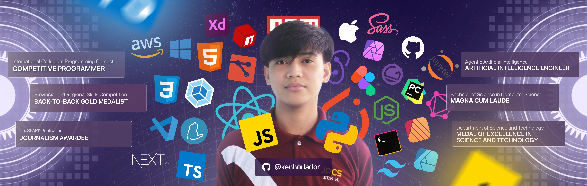

<!-- Header -->

<h1>Hello, I'm an <strong>&lt;OSSadvocate children={ kenhorlador } /&gt;</strong></h1>

<!-- Header -->

<!-- About me -->
<h2><strong>About me</strong></h2>

Howdyyy! <b>I’m Ken Horlador, an Artificial Intelligence (AI) Engineer </b> who has worked extensively with Vision Models across a wide range of applications, including OCR for extracting important information from documents, Object Detection for early prediction of cervical cancer using speculoscopy images, and Image Segmentation for pixel-level refinement in automated yearbook layout production. I have also worked with Large Language Models, Retrieval-Augmented Generation, and Agentic AI—building intelligent systems that help businesses scale without compromising accuracy or AI infrastructure costs.

I hold a Bachelor of Science in Computer Science and graduated within the top 4% of my batch with the distinctions of Magna Cum Laude (Academic Institutional Award), Journalism Awardee (Non-Academic Institutional Award), and the DOST Medal of Excellence in Science and Technology (National Award given to outstanding students in science and technology). Beyond academics, I was a competitive programmer (team lead) who represented my institution in the International Collegiate Programming Contest (ICPC), competing alongside teams from different countries across the Southeast Asian region. I am also a back-to-back Gold Medalist in TESDA, a recognition that reflects my strong foundation in technical and creative problem-solving.

As an exchange student at Institut Teknologi Sepuluh Nopember in Indonesia, I had the opportunity to collaborate with people from diverse cultures and backgrounds while engaging in advanced discussions on Cybersecurity and Artificial Intelligence. That experience strengthened not only my technical perspective but also my ability to communicate, adapt, and innovate in multicultural environments.

I also have extensive experience in software development and system design, particularly in building applications using ReactJS for reusable and scalable components and TailwindCSS for intuitive design. When working with data, I am most comfortable with PostgreSQL for relational systems and MongoDB for handling unstructured information, allowing me to design solutions that are both flexible and reliable.

My future direction is to be part of building intelligent systems that are ethical, human-centered, and genuinely useful to society. My journey continues to be guided by the words of Margaret H. Hamilton, the person I most admire in computer science: “Looking back, we were the luckiest people in the world. There was no choice but to be pioneers; no time to be beginners.”

<!-- Connect with Me -->

  <h2><strong>Connect with me:</strong></h2>
    

        <!-- Facebook -->
        <!-- Instagram -->
        <!-- Twitter -->
        <!-- LinkedIn -->
        <!-- Dribbble -->
        <!-- Leetcode -->
        <!-- Stack Overflow -->
    

<!-- Footer -->

 

<strong>𝚂𝚑𝚘𝚠 𝚜𝚘𝚖𝚎 ❤️ 𝚋𝚢 𝚜𝚝𝚊𝚛𝚛𝚒𝚗𝚐 𝚜𝚘𝚖𝚎 𝚘𝚏 my 𝚛𝚎𝚙𝚘𝚜𝚒𝚝𝚘𝚛𝚒𝚎𝚜!</strong>

<!--
Here are some ideas to get you started:

- 🔭 I’m currently working on ...
- 🌱 I’m currently learning ...
- 👯 I’m looking to collaborate on ...
- 🤔 I’m looking for help with ...
- 💬 Ask me about ...
- 📫 How to reach me: ...
- 😄 Pronouns: ...
- ⚡ Fun fact: ...
-->
